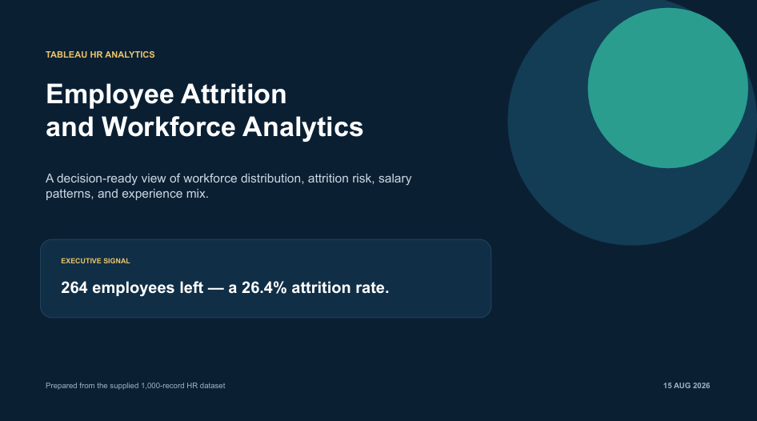

# HR Employee Attrition Analytics

A Tableau project analysing employee distribution, attrition, salary and experience across 1,000 employee records.

## Dashboard Preview

## Key Insights

- 264 employees left, producing a 26.4% attrition rate.
- Male attrition was 29.0%, compared with 23.7% among female employees.
- Sales was the largest department with 272 employees.
- Sales had the highest average salary at $60,575.
- The 16+ years experience group was the largest segment with 402 employees.

## Project Files

- Tableau packaged workbook: `HR_Employee_Attrition_Analytics.twbx`
- Project presentation: `HR_Attrition_Insights_Presentation.pptx`
- Source dataset: `HR_Dashboard_Dataset.csv`

## Tools Used

- Tableau
- CSV data preparation
- Microsoft PowerPoint
